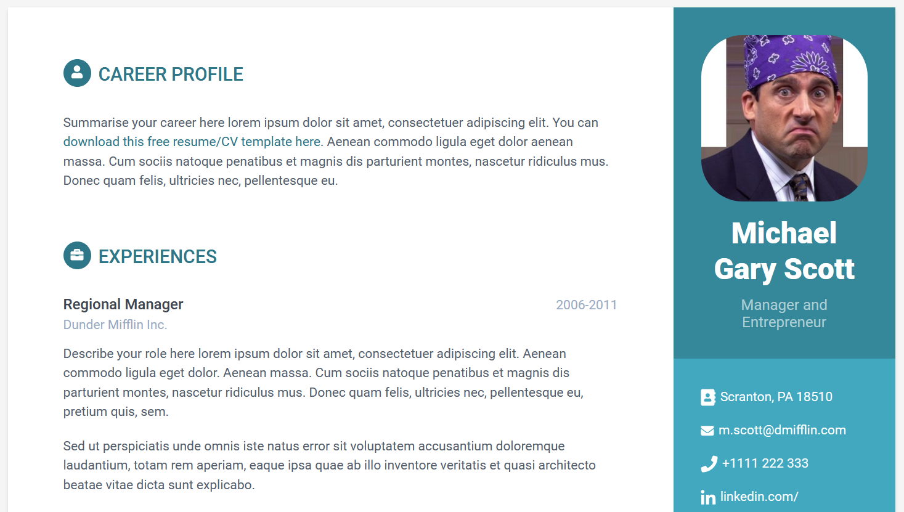

# Description

Click [here](https://reddyman.github.io/Orbit-Theme/) for a live demo!



This is a basic starter resume website, created for educational purposes for [hackGSU 2019](http://hackgsu.com/).

It utilizes a starter bootstrap template theme, scroll down to [Author](#Author-&-License) and [Credits](#Credits) for more information.

# Requirements

- [GitHub Account](https://github.com/join)
- [Node.js](https://nodejs.org/en/download/)
- A good 5 minutes

# Install and Usage

First click that sweet fork button on the top-right hand side.

Then navigate to your forked repository and run:

```
git clone https://github.com/<yourGithubUsername>/Orbit-Theme.git
cd Orbit-Theme
npm install
npm run develop
```

Your primary web browser should now be opened to a live, local version of your website (typically `localhost:3000`).  
Now, navigate to the `/src` folder and start making changes.  
You should see the changes be automatically reflected in your web browser without a manual refresh. Pretty neat, huh!

When you are confident and ready to deploy to your personal github pages website, for anyone on the internet to see:

```
npm run deploy
```

Navigate to your repository on github, and then click on `settings` at the top. Scroll down, and under `GitHub Pages`
you should be able to see the live internet link to your website.

If you want to update your wesbite, simply run the above command to make a new deployment.
You can see the files that were used for the github pages deployment on the `gh-pages` branch in your repo.

# Author & License

This Bootstrap template is made by UX/UI designer [Xiaoying Riley](https://twitter.com/3rdwave_themes) for developers and is 100% FREE under the [Creative Commons Attribution 3.0 License (CC BY 3.0)](http://creativecommons.org/licenses/by/3.0/)

If you'd like to **use the template without the attribution**, you can [buy the **commercial license** via the theme website](https://themes.3rdwavemedia.com/bootstrap-templates/resume/orbit-free-resume-cv-bootstrap-theme-for-developers/)

# Credits

- [Bootstrap](http://getbootstrap.com/)
- [FontAwesome](http://fortawesome.github.io/Font-Awesome/)
- [Orbit-Theme](https://themes.3rdwavemedia.com/bootstrap-templates/resume/orbit-free-resume-cv-bootstrap-theme-for-developers/)
